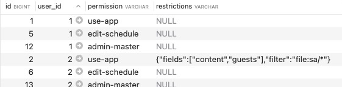

# laravel-simple-permissions


A simple way to define user permissions in your Laravel application: 

* [Authorization Gates](https://laravel.com/docs/master/authorization) are are automatically created for all `'defined_permissions'` in `config/auth.php`:  

    ```php
        'defined_permissions' => [
            'use-app',                  // minimum permission to use the app
            'admin-master',             // master admin privilege
            'view-assets',              // access assets but not able to edit them
            'edit-assets',              // access assets and able to edit them
        ],
    ```

* These can be tested via normal Laravel Authorization methods:

    ```php
    $allowed = Gate::allows('use-app');             // simple test
    $allowed = Gate::allows('use-app|edit-assets'); // ORed permissions (SPECIAL FEATURE)
    ...->middleware('can:use-app');                 // protect in route definitions
    Gate::authorize('use-app');                     // protect elsewhere (ie: controllers)
    @can('use-app')                                 // blade templates
    ```

    > Notice the special '|' character that can be used to test multiple (ORed) permissions in a single gate

* Permissions are assigned to each user via the `user_permissions` table:

    

* Additional Javascript library included - typically used to check additional restrictions in the front-end.  (see below)

*Note: This package is the Authorization (AuthZ) component of our overall AuthN/AuthZ design pattern that we deploy for our apps.  (Our [Faith FM Laravel Auth0 Pattern](https://github.com/faithfm/laravel-auth0-pattern) package is more opinionated than this generic package, and includes a number of published template files that may be less helpful for a wider audience, but you're welcome to use them if they are helpful.)*


### Installation + Configuration:

```bash
composer require faithfm/laravel-simple-permissions
php artisan vendor:publish --tag=laravel-simple-permissions
php artisan migrate                                        # create the 'user_permissions' table
```

* Add the *permissions* relationship to the `Models\User.php` model:

```php
/**
 * Get the permissions for the user.
 */
public function permissions()
{
    return $this->hasMany(\App\Models\UserPermission::class);
}
```

* Create a simple list of `'defined_permissions'` for your app (as a new section in `config/auth.php`).  *(See example above)*

* Assign these permissions to relevant users (by adding records in the `user_permissions` table).   *(See example above)*


### Usage:

You can now test user permissions using regular Laravel Authorization Gate checks!   *(See examples above)*


----

### Advanced Usage: Vue front-end

`LaravelUserPermissions.js` is a helper library that allows additional permission-checks to be performed in the front-end.  

This helper assumes that user permissions are passed from back-end to front-end using a global javascript `LaravelAppGlobals` variable (which is usually passed by the Blade file).  Specifically it is looking for the existence of the global `LaravelAppGlobals.user.permissions` property.

In the examples below we will primarily consider the fourth row of the sample `user_permissions` table above:

```
id:            2
user_id:       2
permission:    use-app
restrictions:  {"fields":["content","guests"],"filter":"file:sa/*"}
```

Simple permission checks use the `laravelUserCan()` function:

```javascript
import { laravelUserCan } from "../LaravelUserPermissions";
if (laravelUserCan("use-app"))
  // ALLOW STUFF TO HAPPEN
```

More complex restrictions checks/filtering test user capabilities against JSON settings stored in the ***restrictions*** field.  In our example above, a call to the `laravelUserRestrictions('use-app')` function returns:

```diff
{
+ status: "SOME PERMITTED",
  fields: ["content","guests"], 
  filter: "file:sa/*"
}
```

The ***status*** property is injected along with any JSON data in the *restrictions* field, and is set to one of the following values:

* `NOT PERMITTED` - if the requested permission (ie: "use-app") does not exist for the user.
* `ALL PERMITTED` - if the requested permission does exist... AND the *'restrictions'* field is blank.
* `SOME PERMITTED` - if the requested permission does exist... AND the *'restrictions'* field contains valid JSON data.

The example below tests these conditions, and also checks to see if an app variable "currentItem" starts with the value of the "filter" property.

```javascript
import { laravelUserRestrictions } from "../LaravelUserPermissions";
const restrictions = laravelUserRestrictions("use-app");
if (restrictions.status == "NOT PERMITTED")
  // PREVENT STUFF FROM HAPPENING
if (restrictions.status == "ALL PERMITTED")
  // UNFILTERED ACCESS
if (restrictions.status == "SOME PERMITTED") {
  // PARTIAL/FILTERED ACCESS BASED ON RESTRICTIONS JSON DATA - IE: ASSUMING 'filter' field
  if (currentItem.startsWith(restrictions.filter)
    // DO STUFF IF FILTER ALLOWS
```

> REMINDER: You should not rely solely on front-end code to enforce important security features.  These should be performed in the back-end as well.


### Sample code to pass permissions via LaravelAppGlobals to front-end:

The following sample code shows one way the 'user' object (including permissions) can be passed to your front-end Vue app via the ***LaravelAppGlobals*** front-end variable.

In your Route/Controller:

```php
  $LaravelAppGlobals = [
    'user' => auth()->user(),     # THIS IS THE IMPORTANT ONE
    'guest' => auth()->guest(),
    'other-stuff' => $myStuff,
    ...
  ];
  return view('myview')->with('LaravelAppGlobals', $LaravelAppGlobals);
```

Blade file:

```html
<!doctype html>
<head>
    <!-- Scripts -->
    <script>
        var LaravelAppGlobals = Object.freeze({!! json_encode($LaravelAppGlobals) !!});
    </script>
    ...
```


----

### Extended Usage: Laravel back-end

An equivalent of the javascript `laravelUserRestrictions()` function has not yet been implemented in the back-end to perform more complex testing based on the *restrictions* field.  In the mean-time you could probably use something like this:

```php
if (Gate::allows('use-app'))
  if (auth()->user()->permissions->restrictions['file'] == 'restrictedfile')
    // ALLOW/DENY STUFF FROM HAPPENING
```

### 
